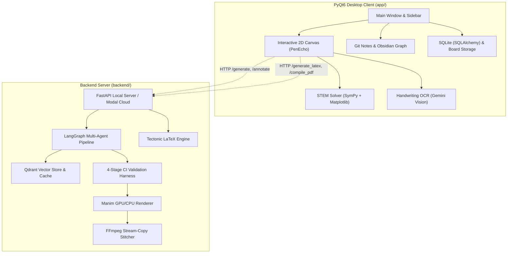

# Kestrel (AI-TUTOR)

Kestrel is an AI-powered desktop STEM tutoring workstation and automated pedagogical media generation system. It couples an interactive PyQt6 canvas workspace with an agentic video generation and LaTeX typesetting backend powered by LangGraph, Manim, and Tectonic.

---

## System Architecture



---

## Key Features

### 1. Interactive STEM Whiteboard Canvas
- **Vector Inking & Smoothing**: Low-latency freehand stroke capture with Catmull-Rom spline fitting and pen stabilization.
- **Smart Geometric Recognition**: Automatic conversion of rough sketches into geometric primitives (circles, rectangles, triangles, regular polygons, directional arrows).
- **PenEcho Diagram Engine**: Vectorized procedural diagrams for scientific domains (benzene rings, coordinate systems, sine/cosine waves, logic gates).
- **Symbolic Math Solver**: In-canvas mathematical evaluation and algebraic simplification via SymPy, accompanied by inline 2D/3D Matplotlib plots.
- **Handwriting OCR**: Canvas stroke recognition converting handwritten formulas and notes into editable text or LaTeX using Google Gemini Vision.

### 2. Multi-Agent Explainer Video Pipeline
- **Document Ingestion**: Parsing and chunking of educational PDFs (`pypdf`) with vector indexing in Qdrant.
- **LangGraph StateGraph Workflow**: Coordinated multi-agent pipeline (`DocumentEmbedder` &rarr; `StoryAgent` &rarr; `ValidatorAgent` &rarr; `CodeGenAgent` &rarr; `CI Harness` &rarr; `RendererAgent` &rarr; `UploaderAgent`).
- **Template-First Code Generation**: Parameterized Manim templates (`concept_explainer`, `math_explainer`, `process_flow`, `comparison`, `matrix_transform`) preventing LLM syntax failures.
- **4-Stage CI Validation**: Pre-render code verification catching syntax, import, scene-graph, and frame-0 runtime errors before GPU execution.
- **Dual Rendering Modes**: Hardware-accelerated OpenGL + `h264_nvenc` encoding on cloud GPUs (Modal A10G), with automatic fallback to Cairo + `libx264` for local CPU rendering.

### 3. Video QA and Lossless Canvas Annotation
- **Interactive Annotation**: Students pause rendered videos, draw highlights on specific frames, attach questions, and submit annotations.
- **Multimodal Context Retrieval**: Highlighting coordinate capture + frame analysis + Qdrant RAG lookup (with Tavily web search fallback).
- **Stream-Copy Stitching**: Rendered explanation clips are spliced into the original video via FFmpeg stream-copy (`-c copy`) without re-encoding existing video segments.

### 4. Interactive LaTeX Typesetting
- **Live LaTeX Compilation**: Direct document compilation using the bundled standalone `tectonic.exe` engine.
- **Structured Academic Templates**: One-click generation of assignments, research papers, homework sets, and lecture slides.
- **Split-View Editor**: Syntax-highlighted LaTeX input alongside real-time PDF previews.

### 6. Real-Time Collaborative Whiteboard
- **LAN & Room-Code Collaboration**: Seamless peer-to-peer collaboration on the infinite whiteboard canvas using automated LAN IP discovery and 6-character room codes (`XXXX-XXXX`).
- **Live Canvas Synchronization**: Zero-latency bidirectional streaming of freehand inking, sticky notes, geometric shapes, text updates, movements, and object deletions.
- **Collaborator Awareness**: Live remote collaborator pointers (`RemoteCollaboratorCursor`) displaying participant names, cursor colors, and active drawing tools.

### 7. Interactive In-Canvas Widgets & PenEcho Arcade
- **Floating Interactive Windows**: Resizable, draggable macOS-style cards (`InteractiveCanvasItem`) embedded directly on the infinite canvas with minimize, collapse, and close controls.
- **Multi-Timezone World Clock**: Comparative circular analog dials and digital cards supporting Colombo (LK), New York (NYC), London (UK), Auckland (NZ), Tokyo, and 500+ world timezones with live ticking hands, UTC offsets, and 1-click `[🕒 Circular]` / `[🔢 Digital]` toggles.
- **PenEcho Procedural Simulations**: Real-time physics and mathematical curve engines:
  - *Planetary Orbit Simulator*: Live gravitational $N$-body dynamics ($F = G \frac{m_1 m_2}{r^2}$) with orbital trails.
  - *Wave Propagation*: Dynamic traveling sine waves ($y(x,t) = A\sin(kx - \omega t)$) with interactive wavelength and frequency sliders.
  - *Harmonic Pendulum*: Damped harmonic oscillation ($T = 2\pi\sqrt{L/g}$) with live angle and damping adjustment.
  - *Procedural Mathematical Curves*: Glowing mathematical curve summons (Lemniscate of Bernoulli, Rhodonea Rose, Lamé Superellipse, Golden Spiral, Deltoid).
- **Embedded Tools & Mini-Games**: Flappy Bird, Retro Snake, Tic-Tac-Toe, Scientific Calculator, Stopwatch & Countdown Timer, Tally Counter, Dice & Coin Flipper, Physics Particle Sandbox, and Unit Converter.
- **On-The-Fly Dynamic Synthesis**: Typo-tolerant prompt detection generating custom interactive PyQt widgets at runtime (Reaction Speed Test, Memory Match, Tone Synth Piano Keyboard, Todo Checklist, Study Flashcards).

---

## Repository Layout

```
AI-TUTOR/
├── app/                           # PyQt6 Desktop Client
│   ├── backend/                   # Client-side service clients & engines
│   │   ├── knowledge_graph/       # Tag and wikilink graph parser
│   │   ├── math_engine/           # SymPy solver & LaTeX client
│   │   ├── ocr/                   # Handwriting OCR client
│   │   ├── version_control/       # Git repository manager
│   │   └── video_generation/      # Video generation API client
│   ├── collaboration/             # Real-time WebSocket/TCP collaboration engine
│   │   ├── collab_client.py       # Client socket listener & canvas dispatcher
│   │   ├── collab_server.py       # Local room server & state distributor
│   │   └── collab_session_manager.py # Session lifecycle & room codes
│   ├── storage/                   # Database models & board file persistence
│   ├── tests/                     # PyQt6 client unit & integration tests
│   ├── ui/                        # Canvas scene, views, widgets, and items
│   │   ├── items/interactive_widgets/ # World clock, arcade games, PenEcho sims
│   │   └── penecho_integration/   # Procedural curves, animation & draft layer
│   └── main.py                    # Desktop application entry point
├── backend/                       # Server-side Video & LaTeX Pipeline
│   ├── ci/                        # 4-stage validation harness
│   ├── math_engine/               # LaTeX generation pipeline
│   ├── video_generation/          # LangGraph multi-agent workflow & templates
│   ├── video_qa/                  # Video annotation handler & FFmpeg stitcher
│   ├── workspace/                 # Qdrant vector store & cache
│   ├── local_server.py            # Local FastAPI server
│   └── modal_app.py               # Cloud serverless deployment (Modal)
├── docs/                          # Detailed technical documentation
├── tests/                         # Collaboration & interactive widget test suite
├── requirements.txt               # Unified project dependencies
└── tectonic.exe                   # Standalone XeTeX compiler executable
```

---

## Quickstart

### Prerequisites
- Python 3.10 to 3.14 (Python 3.11 recommended for Modal cloud parity)
- Git installed and accessible on your system `PATH`
- FFmpeg installed and accessible on `PATH` (optional for local dev: `imageio-ffmpeg` provides fallback)
- Windows x64 / Linux / macOS (Tectonic binary bundled for Windows; installed via system packages on Linux/macOS)

### 1. Clone and Create Virtual Environment

```bash
git clone https://github.com/DakshayaniRamanesh/AI-TUTOR.git
cd AI-TUTOR

# Create virtual environment
python -m venv venv

# Activate virtual environment
# Windows (PowerShell):
.\venv\Scripts\Activate.ps1
# Linux/macOS:
source venv/bin/activate
```

### 2. Install Dependencies

```bash
pip install -r requirements.txt
```

### 3. Configure Environment Variables

Create `backend/.env` based on `backend/.env.example`:

```bash
cp backend/.env.example backend/.env
```

Configure the essential API keys:

```ini
# Groq API Key (required for high-speed script & widget generation)
GROQ_API_KEY=gsk_your_groq_api_key

# Google Gemini API Key (required for vision, OCR, and embeddings)
GOOGLE_API_KEY=AIzaSy_your_gemini_api_key

# Qdrant Vector Store (default local instance)
QDRANT_URL=http://localhost:6333
QDRANT_API_KEY=
```

### 4. Run the Backend Server

Start the local FastAPI pipeline server:

```bash
python backend/local_server.py
```

The server binds to `http://0.0.0.0:8000`. Verify endpoints via `http://localhost:8000/docs`.

### 5. Launch the Desktop Application

In a separate terminal (with the virtual environment activated):

```bash
python app/main.py
```

---

## Testing

Execute the test suites using pytest:

```bash
# Run interactive widgets & arcade test suite
python -m pytest tests/test_interactive_widgets.py -v

# Run real-time collaboration test suite
python -m pytest tests/test_collaboration.py -v

# Run client application test suite
python -m pytest app/tests
```

All test cases covering canvas state serialization, stroke processing, collaboration sync, interactive widgets, and PenEcho procedural simulations pass cleanly.

---

## Documentation Index

For detailed specifications, consult the `/docs` directory:

| Document | Description |
| :--- | :--- |
| [Architecture Guide](docs/ARCHITECTURE.md) | In-depth breakdown of desktop client, LangGraph multi-agent pipeline, and data flow. |
| [API Reference](docs/API_REFERENCE.md) | Complete documentation of all REST endpoints, request/response schemas, and status codes. |
| [Configuration Reference](docs/CONFIGURATION.md) | Complete environment variable tables, storage layouts, and hardware acceleration options. |
| [Developer Guide](docs/DEVELOPER_GUIDE.md) | Development workflow, environment setup, testing standards, and diagnostics. |
| [Performance Optimizations](docs/OPTIMIZATIONS.md) | Analysis of GPU rendering, NVENC encoding, CI smoke tests, caching, and streaming updates. |
