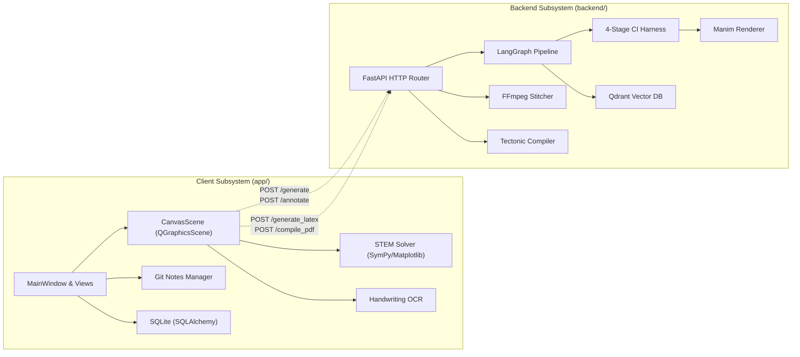
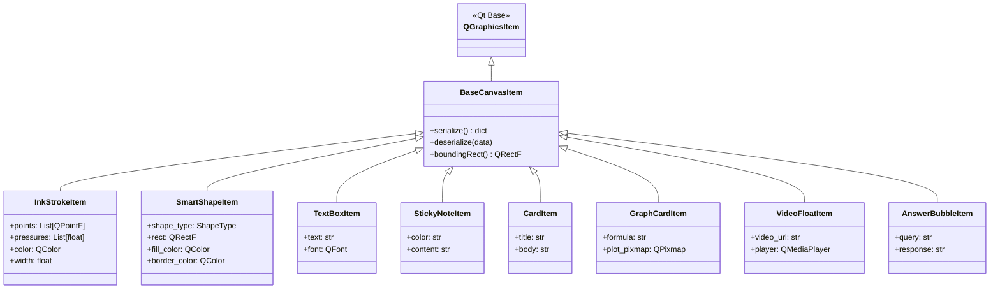
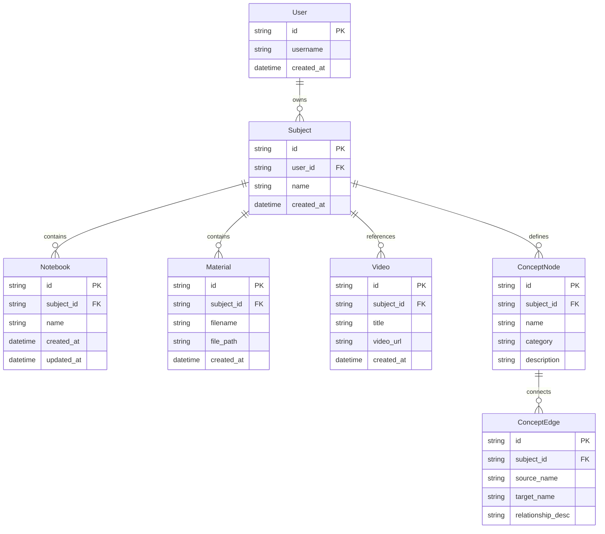
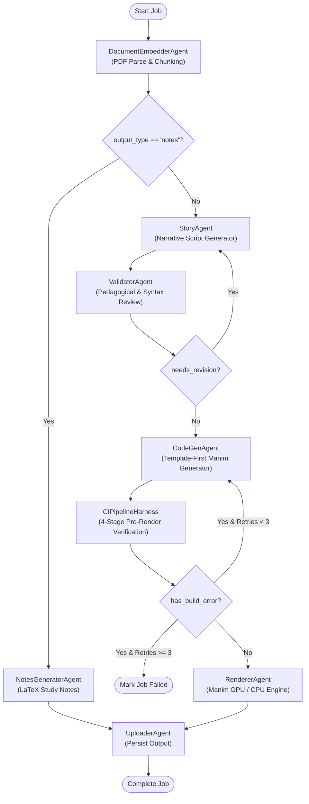
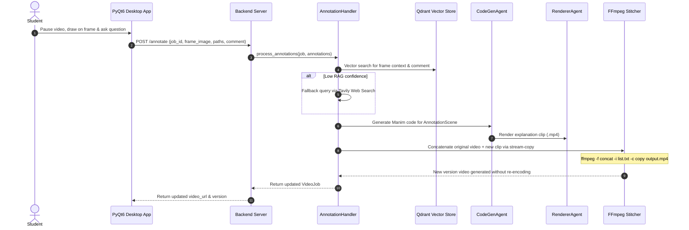

# Architecture and Design Specification

This document provides a technical description of the Kestrel (AI-TUTOR) system architecture, covering the client-side desktop workstation (`app/`), the server-side media generation pipeline (`backend/`), data models, storage design, and inter-process communication.

---

## 1. System Overview

Kestrel is divided into two decoupled subsystems:
1. **Desktop Client (`app/`)**: A PyQt6 desktop application offering an infinite 2D canvas, tablet-grade stylus input, symbolic mathematics engine, LaTeX typesetting, knowledge graph visualization, and Git-backed study notes.
2. **Media & Compute Backend (`backend/`)**: A stateless service exposing REST endpoints for generating Manim explainer animations, compiling LaTeX documents via Tectonic, performing multimodal vector RAG via Qdrant, and stitching video annotations via FFmpeg. It operates either as a local FastAPI server (`local_server.py`) or as a serverless cluster on Modal (`modal_app.py`).

---

## 2. Desktop Client Architecture (`app/`)

### 2.1 Window and View Hierarchy

The desktop interface uses a single-window architecture (`MainWindow` in `app/ui/main_window.py`) built upon PyQt6:
- **Title Bar (`MacTitleBar`)**: Custom window bar providing macOS-style controls (close, minimize, maximize), document title, and drag handlers.
- **Navigation Sidebar**: Left-docked navigation bar switching between specialized views:
  - `HomeView`: Dashboard with recent notebooks, active subjects, quick actions, and system metrics.
  - `NotebooksPanel`: Tree-structured notebook and folder explorer backed by `NotebookStorage`.
  - `SubjectsListView` & `SubjectDetailView`: Subject curriculum management, linking reference PDFs, notes, video files, and concept maps.
  - `GitNotesPanel`: Version-controlled markdown workspace backed by an embedded Git repository.
  - `ObsidianGraphPanel`: Interactive node-link graph visualization of knowledge nodes and wikilinks.
- **Canvas View (`CanvasView` & `CanvasScene`)**: Centrally embedded infinite 2D workspace hosting interactive `QGraphicsItem` instances.

### 2.2 Canvas Scene and Custom Item Hierarchy

The whiteboard workspace extends `QGraphicsScene` (`app/ui/canvas_scene.py`) and `QGraphicsView` (`app/ui/canvas_view.py`):

### 2.3 Stroke Processing and Geometric Fitting

Stroke input from mice or drawing tablets is processed by `StrokeProcessor` (`app/ui/stroke_processor.py`):
1. **Raw Point Sampling**: Captures `(x, y)` coordinates along with tablet pressure (`pressure`) at microsecond intervals.
2. **Smoothing & Spline Interpolation**: Applies Catmull-Rom spline interpolation and exponential moving average filters to eliminate jitter.
3. **Geometric Shape Detection**:
   - Analyzes stroke closure, convex hull, aspect ratio, and angular variance.
   - Automatically maps qualifying strokes into regular shapes: `circle`, `rectangle`, `triangle`, `polygon`, `line`, `arrow`, or `double_arrow`.
   - If geometric confidence is below the threshold, preserves the raw smoothed ink stroke.

### 2.4 PenEcho Procedural Scientific Diagrams

Located in `app/ui/penecho_integration/`, this subsystem renders standardized procedural scientific illustrations directly into the canvas:
- `benzene_ring`: Hexagonal aromatic rings with alternating or conjugated pi-electron circles.
- `coordinate_system`: Orthogonal 2D axes with tick marks, arrows, and optional grid lines.
- `wave_function`: Procedural sine, cosine, or damped harmonic wave paths.
- `logic_gates`: Standard ANSI IEEE logic gates (AND, OR, NOT, NAND, NOR, XOR).
- `chemical_bonds`: Single, double, and triple covalent bond vectors.

### 2.5 Symbolic STEM Computation Engine

Located in `app/backend/math_engine/stem_solver.py`:
- Parses raw natural language or LaTeX mathematical prompts via SymPy.
- Evaluates roots, derivatives, definite/indefinite integrals, matrix eigenvalues, and algebraic limits.
- Generates 2D and 3D visual function plots using Matplotlib, writing image buffers to `storage_data/plots/` and instantiating inline `GraphCardItem` elements on the canvas.

### 2.6 Client Storage Subsystem

The desktop client maintains local state across four primary persistent stores:

| Storage Unit | Path | Mechanism | Purpose |
| :--- | :--- | :--- | :--- |
| **Relational Database** | `storage_data/kestrel.db` | SQLite via SQLAlchemy | Relational storage for users, subjects, materials, video metadata, and concept nodes/edges. |
| **Board Storage** | `storage_data/boards/*.json` | JSON serialization | Canvas scene serialization, storing item coordinates, stroke points, and item properties. |
| **Git Notes Repository** | `storage_data/git_notes_repo/` | Embedded Git repository | Tracks markdown study notes and synchronized board states with revision history. |
| **LaTeX Compilation** | `storage_data/latex_exports/` | File system | Stores generated `.tex` documents and compiled `.pdf` files. |

---

## 3. Backend Pipeline Architecture (`backend/`)

The backend pipeline automates pedagogical animation creation and LaTeX compilation.

### 3.1 LangGraph Multi-Agent Video Generation Pipeline

The pipeline is modeled as a compiled LangGraph `StateGraph` (`backend/video_generation/graph.py`), maintaining state via a shared `VideoJob` object:

#### Pipeline Agents and Responsibilities

1. **`DocumentEmbedderAgent` (`backend/video_generation/agents/document_embedder.py`)**:
   - Reads input PDF files using `pypdf`.
   - Validates page count constraints (maximum 20 pages).
   - Splits document text into 500-token semantic chunks.
   - Extracts key scientific concepts and relationships, inserting `ConceptNode` and `ConceptEdge` records into `storage_data/kestrel.db`.
   - Indexes embeddings into Qdrant collections using Google Gemini embeddings.

2. **`StoryAgent` (`backend/video_generation/agents/story_agent.py`)**:
   - Queries Qdrant RAG store with the user prompt to retrieve pertinent chunks.
   - Invokes Groq (`llama-3.3-70b-versatile` / `llama-3.1-8b-instant`) or Gemini fallback.
   - Constructs a structured narrative script consisting of scene objectives, visual animation requirements, mathematical expressions, and voiceover text.

3. **`ValidatorAgent` (`backend/video_generation/agents/validator_agent.py`)**:
   - Reviews narrative scripts against pedagogical rubrics: clarity, grade-level vocabulary, and technical feasibility in Manim.
   - Flags issues and requests revisions from `StoryAgent` up to a maximum limit.

4. **`CodeGenAgent` (`backend/video_generation/agents/codegen_agent.py`)**:
   - Generates executable Python code subclassing Manim's `Scene`.
   - **Template Strategy (Primary)**: Automatically maps the topic to one of five vetted templates in `SceneTemplateLibrary` (`concept_explainer`, `math_explainer`, `process_flow`, `comparison`, `matrix_transform`), filling structured variable slots to guarantee syntax integrity.
   - **Free-Generation Strategy (Fallback/Retry)**: Engages when a template does not fit or after CI failures, feeding stderr compiler traces back into the prompt.
   - **Text vs. MathTex Optimization**: Enforces standard `Text()` for all prose and labels, reserving LaTeX `MathTex()` strictly for mathematical formulas.

5. **`RendererAgent` (`backend/video_generation/agents/renderer_agent.py`)**:
   - Executes Manim render commands.
   - Attempts hardware-accelerated rendering (`--renderer=opengl`); automatically falls back to Cairo if OpenGL or GPU contexts are unavailable.
   - Performs hardware video post-encoding using `h264_nvenc` when an NVIDIA GPU is detected, falling back to `libx264`.
   - Automatically injects `-pix_fmt yuv420p` and `-movflags +faststart` for universal browser and desktop media player compatibility.

6. **`UploaderAgent` (`backend/video_generation/agents/uploader_agent.py`)**:
   - In cloud mode: Uploads rendered `.mp4` files to DigitalOcean Spaces (S3) and updates Firestore.
   - In local mode: Verifies the local filesystem path and formats the static file URL (`http://localhost:8000/video/{filename}`).

7. **`NotesGeneratorAgent` (`backend/video_generation/agents/notes_agent.py`)**:
   - Engaged when `output_type == "notes"`.
   - Generates structured LaTeX study notes from document text.
   - Compiles `.tex` files into PDF using `tectonic.exe` and saves output to `storage_data/latex_exports/`.

---

### 3.2 4-Stage CI/CD Validation Harness (`backend/ci/pipeline.py`)

To prevent expensive GPU render aborts due to runtime code errors, generated Manim scripts must pass four pre-flight stages:

| Stage | Name | Mechanism | Failure Caught |
| :--- | :--- | :--- | :--- |
| **Stage 1** | Syntax Validation | `py_compile.compile()` | Python indentation, invalid characters, syntax errors. |
| **Stage 2** | Import & Runtime Check | Subprocess Python import | Missing imports, undefined symbols, invalid module attributes. |
| **Stage 3** | Scene Graph Dry-Run | `manim render --dry_run` | Invalid Mobject hierarchies, unknown color constants (e.g., `CYAN`), broken `.animate` method chains. |
| **Stage 4** | Frame-0 Smoke Render | `manim render -ql -s` | Broken LaTeX in `MathTex` formulas, unescaped characters, runtime construction crashes. |

Any failure at Stage 1–4 captures `stderr`, increments `retry_count`, and routes back to `CodeGenAgent` with the compiler diagnostic.

---

### 3.3 Video QA and Lossless Stream-Copy Stitching

Students can pause a video, draw on top of the frame, type a question, and receive an appended video explanation:

---

### 3.4 Vector RAG and Cross-Student Video Cache

Managed by `QdrantRAGStore` (`backend/workspace/qdrant_store.py`):
1. **Document Chunks Collection (`manim-docs`)**: Stores 768-dimensional or 3072-dimensional vector embeddings for uploaded PDF sections.
2. **Cross-Student Video Cache Collection (`manim-video-cache`)**:
   - Generates a SHA-256 hash over the user prompt and the first 2,000 characters of the source document text.
   - When a job is requested, Qdrant performs:
     - **Exact Hash Match**: Identical document section and prompt text &rarr; returns cached video URL in &lt;50ms.
     - **Semantic Similarity Match**: Same document with semantic threshold &ge; 0.92 &rarr; returns cached video immediately.
   - Eliminates redundant GPU compute for common curricula questions across multiple students.

---

### 3.5 LaTeX Compilation Engine (`backend/math_engine/latex_graph.py`)

LaTeX generation and compilation operate as an autonomous pipeline:
1. **Transcription & Structuring**:
   - Accepts base64 encoded handwriting or canvas image data.
   - Transcribes math and text using Gemini Vision into clean, structured LaTeX.
   - Injects the transcription into one of four pre-defined templates (`assignment.tex`, `homework.tex`, `lecture_slides.tex`, `research_paper.tex`).
2. **Compilation**:
   - Compiles the `.tex` file via the standalone `tectonic.exe` binary.
   - Tectonic automatically resolves and caches required TeX packages on-demand, eliminating manual package management.
   - Outputs compiled `.pdf` documents and returns base64 buffers or download URLs.
