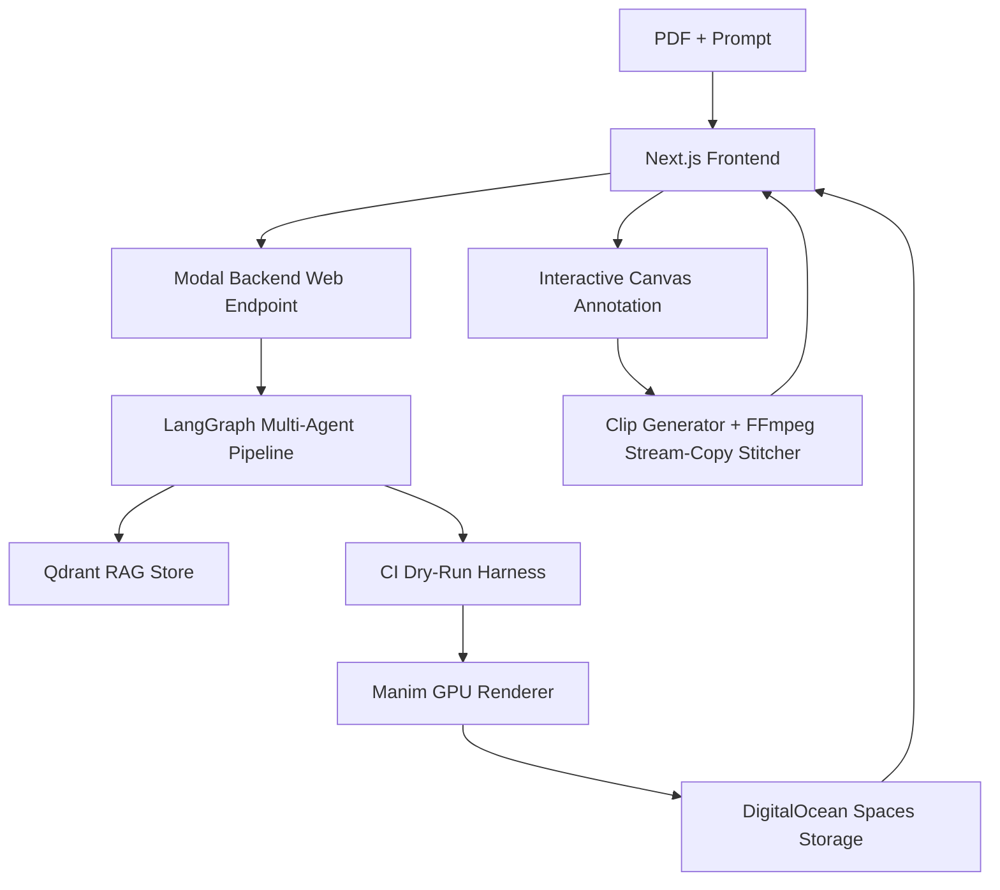

# Manim AI Video Generator

An AI-driven explainer video generator and interactive canvas annotation system powered by Manim, LangGraph, Google Gemini, Qdrant, Modal, and Next.js.

## System Workflow



## Quick Start

### Backend (Modal)
1. Install dependencies:
   ```bash
   cd backend
   pip install -r requirements.txt
   ```
2. Set environment variables in `.env` (refer to `.env.example`).
3. Deploy or run locally with Modal:
   ```bash
   modal serve modal_app.py
   ```

### Frontend (Next.js)
1. Install dependencies:
   ```bash
   cd frontend
   npm install
   ```
2. Run development server:
   ```bash
   npm run dev
   ```
3. Open [http://localhost:3000](http://localhost:3000) in your browser.

## Documentation
- [Architecture Overview](file:///d:/ai%20tutor/docs/ARCHITECTURE.md)
- [Developer & Setup Guide](file:///d:/ai%20tutor/docs/DEVELOPER_GUIDE.md)
- [API Reference](file:///d:/ai%20tutor/docs/API_REFERENCE.md)
- [Build Prompt Specification](file:///d:/ai%20tutor/docs/BUILD_PROMPT.md)
